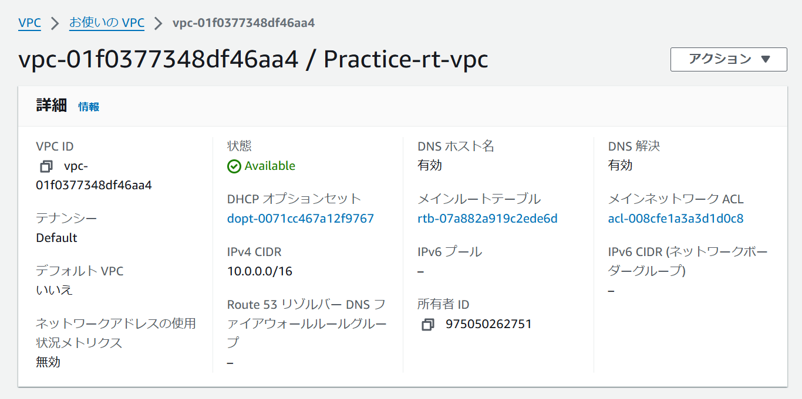
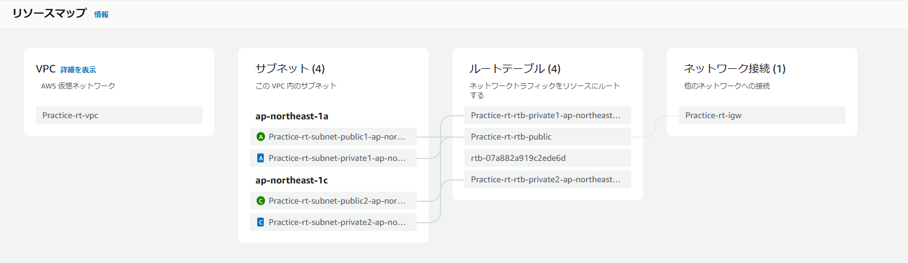
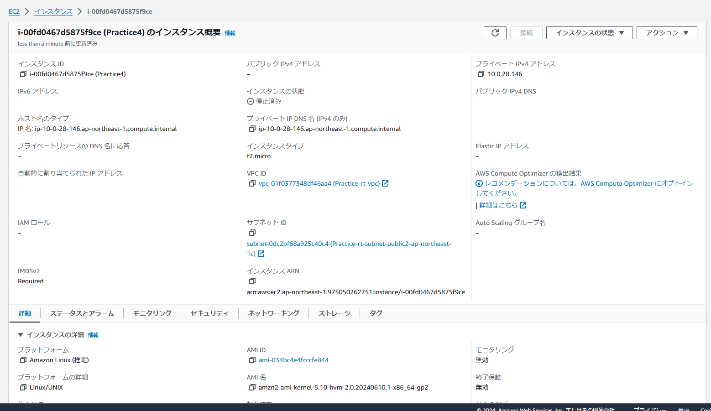
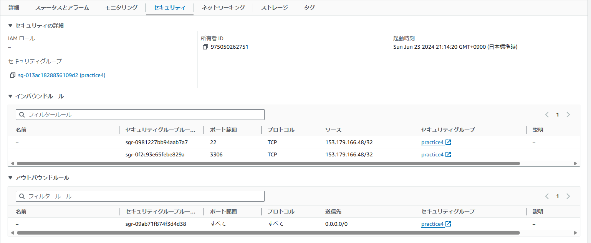
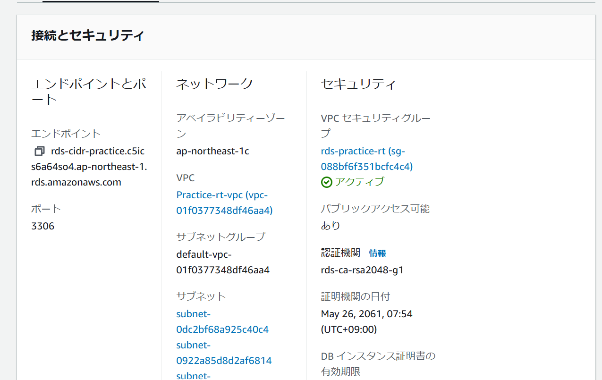
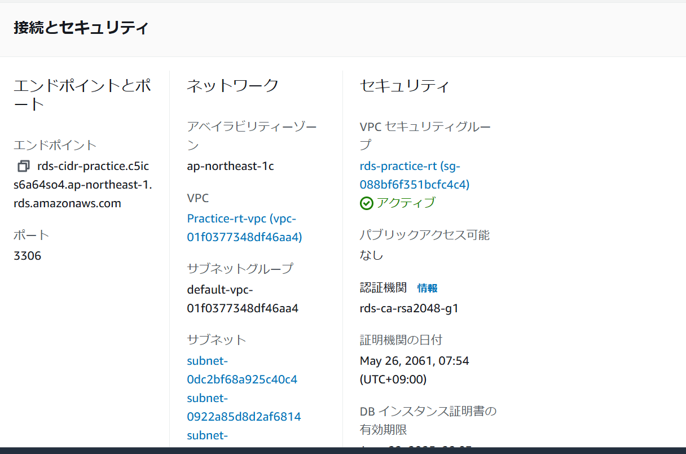

# 第４回課題提出
## 実施内容
### VPCの作成

第４回課題に沿って作成

### EC2作成

1. 無料枠で利用できる範囲で機能を選択
2. 今回作成したVPCを選択
3. SSH接続のためプライベートIP　DNSを取得
4. 第３回までLinux2を使っており、今後の課題で同じアプリを起動することを考え
   無料枠の中で2023ではなく2を選択
5. Ec2パブリックサブネットに配置（RDSとは異なる場所に配置）
6. Ec2のセキュリティグループはインバウンドでSSH接続で自分のIPを許可
（自分のIPアドレスが固定されないため再度ログインするとセキュリティグループを変える必要があり面倒）
7. RDS接続するためインバウンドでmysqlへの接続を許可するためmysqlも自分のIPを許可

### RDSの作成

1. 無料利用枠内で作成
2. セキュリティグループのインバウンドはMYSQLですべてのIPを許可

### EC2からRDSへの接続

検索したところmysqlを起動し、RDSのエンドポイントを入力することでRDSに接続できる

## 感想
全くIT未経験なので結構難しかった。
単語の理解や、そもそものネットワークの通信の内容を理解するために
ITパスポート等の動画を見て勉強したりした。サブネットなどわかりにくい内容も多かった。
実際に知識をインプットしてから実際に作業すると少し知識が深まるところもあった。

躓いた際に、１つできないことがあり調べるといくつかの解決策が出てくる。
最初のうちは勉強のため複数パターンを試して、どのパターンがベストなのか探すようにしたい。

### 修正点
RDSのパブリックアクセス可能を「なし」に変更
