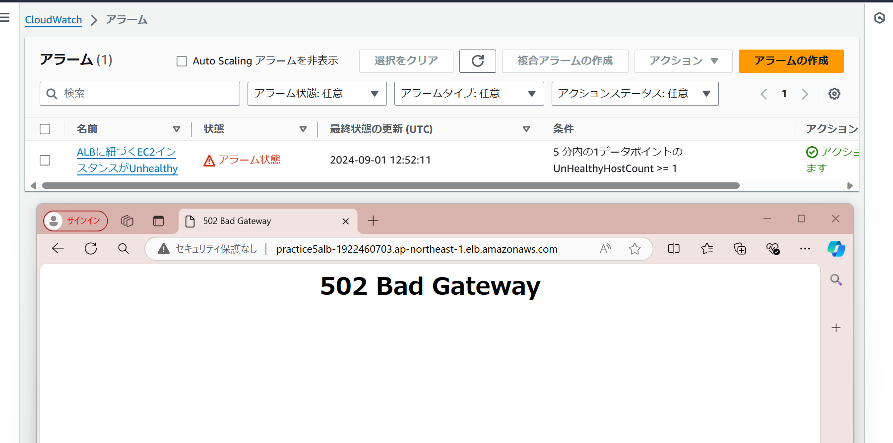
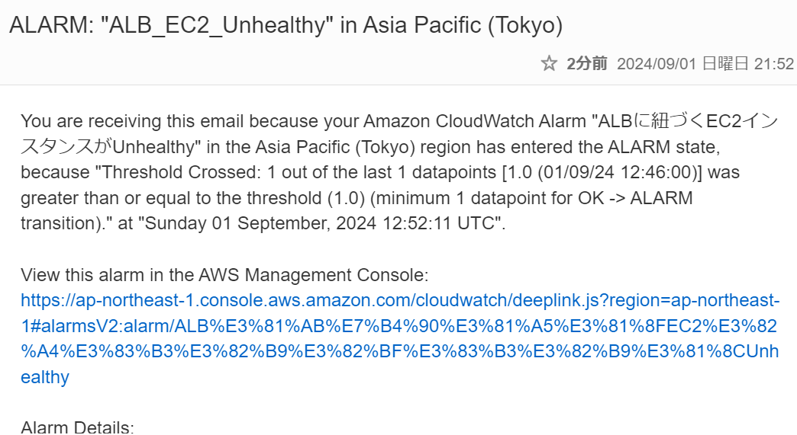
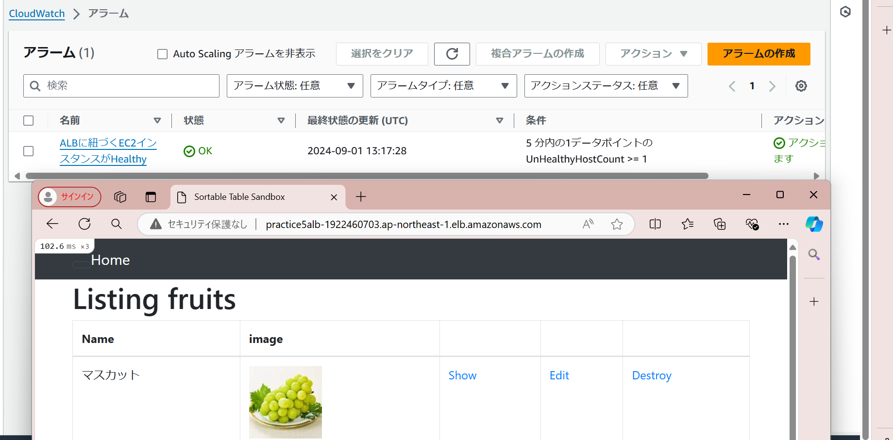
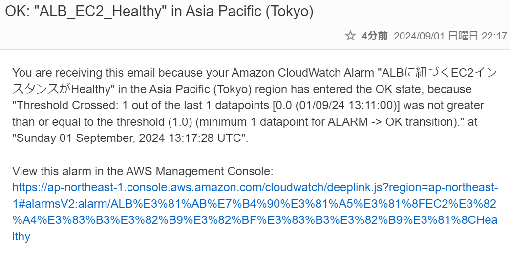
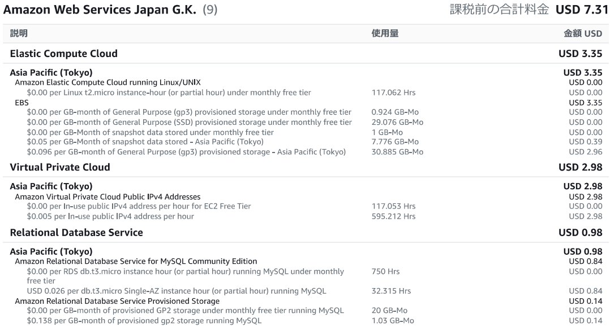

## 第６回実施したこと

### Cloudtrailのイベントのピックアップ

イベント名：ModifySecurityGroupRules
含まれる情報　セキュリティグループルールのID
　　　　　　　ログインに使用した情報
　　　　　　　TLSのバージョンバージョン

### ALBのアラート設定
・AmazonSNSで通知先メールアドレスを作成
・Cloudwatchでメトリクス作成、アラートを設定

#### 1.Ec2がUnhealthyのときに通知

#### 2.条件を変更し、OKのとき＝Healthyのときに通知

### AWS利用料金の見積作成
これまで東京リージョンで作ってきたが、調べてみたところUSで作成したほうが値段が安いことがわかった。
どのリージョンでも価格やサービスは全く同じだと思っていたため少し驚いた。
価格だけでなく、製品とサービスや新機能リリー速度など、リージョンによって少し違いがあるらしい。
地理的に近いところを選ぶほうが、接続スピードが速い等のメリットがあるようだが、
今回サンプルアプリを作る想定なので、安いバージニア北部で見積を作成した。

[見積のリンク](https://calculator.aws/#/estimate?id=9b73ca03b711b6076878bf67c87611d698eb43e7)

### 現在の利用料金

先月は急に請求金額があがっている。要因は２つ。

#### 1.EBSの容量超過

先月は第５回課題を実施する際、インストールが進まないソフトがあり、
その際に容量を増やしたり新しくインスタンスを作成してインストールしてみたり、
試行錯誤した際にEBS30GBを超過している。

#### 2.VPC

パブリック IPv4 アドレスの使用時間が長く無料枠を超えてしまった。
８月は第５回課題で起動時間が長かったためと考えている。

#### 3.RDS

こちらも課題をやる中で少しだけ２個作成した期間があり、無料枠を超えている。
すぐに削除したため、少額の請求で９月７日現在９月の請求はなし。

### 今回学んだこと

コストの話が出てきて、自分が設定した内容によりコスト面に大きな影響を与えてしまうかもしれない、
という点ですごく気が引き締まったし、ミスしたときの損害を考えると恐ろしい。
AWSのサービスをよく理解するために、資格の取得も頑張ろうと思うし、サービスのアップデートに合わせ
学び続ける必要を改めて感じた。