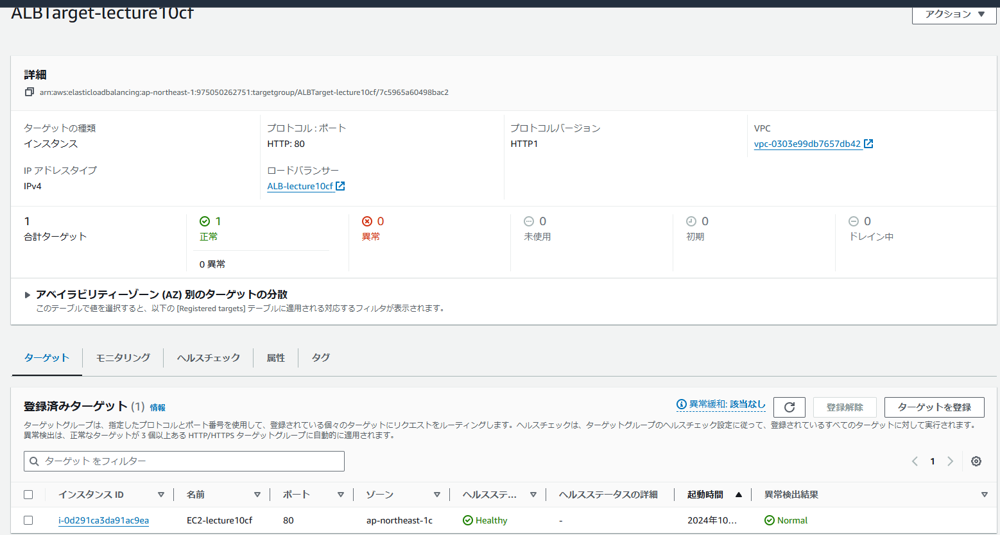

# 第10回課題
## 実施した内容
これまで構築した環境をCloudformationで自動化

構成図は以下のとおり（第５回課題より）

※接続の確認のため、mySQL,Nginx,CLIをUserdateでインストール

####スタックは、以下のとおりネットワーク、セキュリティ、アプリケーションの３つに分けて作成した。

・[ネットワークyml](/yml10/Lecture10_network)
　VPC構築/２つのAZに合計サブネットを４つ構築/IGWを構築し、パブリックサブネット２つを接続
 

・[セキュリティyml](/yml10/Lecture10_security)
　EC2のセキュリティグループ作成
  
　RDSのセキュリティグループ作成
  
　S3接続用にIAMポリシーを作成
　

・[アプリケーションyml](/yml10/Lecture10_App.yml)

  EC2構築
　
　ALB構築
　
  ALBターゲットグループ、接続確認（ヘルスチェック）
  
　RDS構築
　
　EC2からRDSに接続できるか確認
　
　S3構築
　
　EC2からS3のフォルダを編集する権限があるか、接続確認
　（S3にデータを入れ、削除できるか確認）
　
　
##第１０回の感想
最初は書きなれないのでエラーが多かったがだんだん慣れてくると便利でおもしろかった。
Userdataも入れてみたかったので、接続確認用にmysqlなどをインストールしてみた。
あっという間に同じ環境を再現できるのはクラウドならではだと思うし、すごく便利だと感じた。
インターネットを見ると、リソースごとに分けてスタックを書いている例が
多いように思ったが、セキュリティ関係は分散するより１枚にまとまっている
ほうが漏れがなく安全に管理がしやすいのではないかと感じたため、リソースごとではなく
ネットワーク、セキュリティ、アプリに分けて作成した。