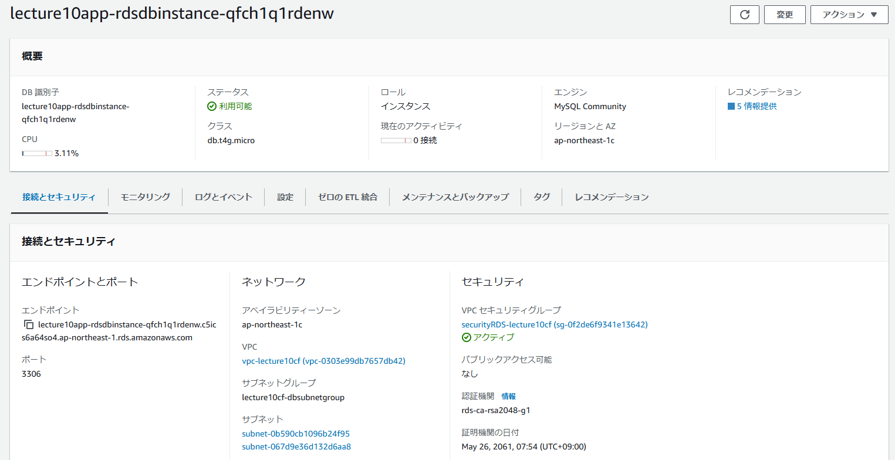

# 第10回課題
## 実施した内容
### これまで構築した環境をCloudformationで自動化
スタックは、以下のとおりネットワーク、セキュリティ、アプリケーションの３つに分けて作成した。 
1.ネットワーク 
  東京リージョン内にVPC、IGWを構築 
  ２つのAZを使用し、  それぞれのAZにパブリックサブネット、プライベートサブネット　合計４つのサブネット構築

2.セキュリティ 
  EC2のセキュリティグループ 
  RDSのセキュリティグループ 
  S3へのアクセスのためのIAMロール、ポリシー

3.アプリケーション
  パブリックサブネットの1つにEC2を構築 
  EC2から、プライベートサブネットに構築したRDSに接続 
  ALBを構築し、外部のインターネットからの接続をALBで受付け、EC2に接続 
  VPC外にS3を構築し、EC2から接続 
※接続の確認のため、MySQL,Nginx,AWS CLIをUserdateでインストールも実施 

・[スタック１：ネットワーク](/Lecture10_network.yml) 

 VPC構築/２つのAZに合計サブネットを４つ構築/IGWを構築し、パブリックサブネット２つを接続 
  

・[スタック２：セキュリティ](/Lecture10_security.yml) 

　EC2のセキュリティグループ 
  
　RDSのセキュリティグループ 
  
　S3へのアクセスのためのIAMロール、ポリシー 
　

・[スタック３：アプリケーション](/Lecture10_App.yml) 

  パブリックサブネットの1つにEC2を構築 
　
  RDSの構築 
  
　EC2から、プライベートサブネットに構築したRDSに接続 
  
　ALBを構築 
  
  外部のインターネットからの接続をALBで受付け、EC2に接続 
  (ターゲットグループ、ヘルスチェック） 
  
　S3構築 
　
　EC2からS3に接続 
　（S3にデータを入れ、削除できるか確認） 
　
　
## 第１０回の感想 
最初は書きなれないのでエラーが多かったがだんだん慣れてくると便利でおもしろかった。 
Userdataも入れてみたかったので、接続確認用にMySQLなどをインストールしてみた。 

ネットでCloudformationを作成している事例を見ると、リソースごとに分けてスタックを書いている例が 
多いように思ったが、セキュリティ関係は分散するより１枚にまとまっている 
ほうが漏れがなく安全に管理がしやすいのではないかと感じたため、リソースごとではなく 
ネットワーク、セキュリティ、アプリに分けて作成した。
