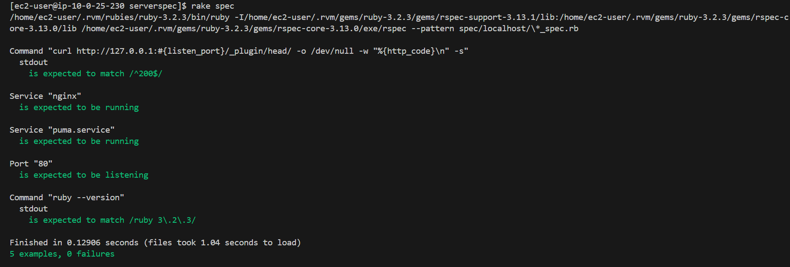
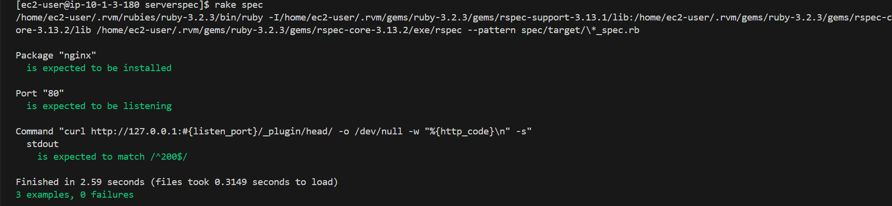

# 第11回課題

## １．実施したこと
Serverspecでサンプルアプリケーションが問題なく動作するかテストする

### Serverspecのインストール
serverspec　という名称のファイルを作成し、そのファイルのディレクトリでインストール・設定を行う

```
mkdir serverspec
cd serverspec
gem install serverspec
serverspec-init　#以下、対話形式で回答する
Select OS type:

  1) UN*X
  2) Windows

Select number: 1

Select a backend type:

  1) SSH
  2) Exec (local)

Select number: 2

 + spec/
 + spec/localhost/
 + spec/localhost/sample_spec.rb
 + spec/spec_helper.rb
 + Rakefile
 + .rspec
```

### sample_spec.rbにテストしたい内容を記述
[sample_spec.rbのテストコード](/spec_helper.rb)

1. urlでHTTPアクセスして200 OKが返ってくるか
1. Nginxが起動しているか
1. Puma.が起動しているか
1. 80ポートがリッスンしているか
1. Rubyの指定のバージョンがインストールされているか

### 実行結果
「rake spec」で実行、下記の画像のとおり、テストの成功を確認
 <br>

<details><summary>おまけでSSHでの接続も実施（長くなったので折りたたみで記載）</summary>

 ローカルで起動は確認できたが、SSH接続もお試しで少しトライ。  
（よくアプリケーションの構成で、プライベートサブネット・パブリックサブネットにそれぞれ  
EC2を１台ずつ立てて、パブリックサブネットにあるEC2を踏み台サーバーとして  
プライベートサブネットのEC2に接続するという構成も見かけるので、一度EC2からEC2への接続をしてみたかったので実施）

#### Serverspecのインストール（接続元サーバ）
SSH接続で実施する場合は、テストしたいサーバと別のサーバにインストールする。  
インストールコマンドは同じだが、インストール後の実施手順が異なる。

```
serverspec-init #以下、対話形式で回答する
Select OS type:

  1) UN*X
  2) Windows

Select number: 1

Select a backend type:

  1) SSH
  2) Exec (local)

Select number: 1

Vagrant instance y/n: n
Input target host name: ec2_client
 + spec/
 + spec/ec2_client/
 + spec/ec2_client/sample_spec.rb
 + spec/spec_helper.rb
 + Rakefile
 + .rspec
```

#### 秘密鍵・公開鍵作成（接続元サーバ）
今回は、秘密鍵・公開鍵を作成し、公開鍵をテストしたいサーバに格納することでEC2からEC2への接続を許可する。  
Githubに鍵を格納しないように注意！！

```
ssh keygen（鍵の作成コマンド）
# 今回はパスワードは設定しない。（空欄でEnterでOK）
cd .ssh/
ls　#中にid_rsa（秘密鍵） id_rsa.pub（公開鍵）が作成されていることを確認
```
catなどのコマンドで公開鍵の中身をコピーする。

#### 公開鍵のコピー（接続先サーバ）
```
cd .ssh/
touch authorized_keys
vim authorized_keys
#先ほどコピーした公開鍵を貼り付ける(すでにauthorized_keysがある場合は touchコマンド省略、追記する)
```

(手動でやってしまったがコマンドでもできるかもしれない。  
Ref:https://qiita.com/kazokmr/items/754169cfa996b24fcbf5）

#### configの設定（接続元サーバ）
configにSSHに接続するための情報を記載する。
```
cd .ssh/
touch config
vim config
```
configの内容
```
Host "インストール後にnameで設定した名前"
        HostName "接続先のEC2のプライベートIP"
        IdentityFile ~/.ssh/authorized_keys
        User ec2-user
        ServerAliveInterval 30
```

上記を記載後、HOMEディレクトリで「SSH 設定した名前」を実施して接続できればOK

おまけなので、サンプルのテストコードをベースに実施。  
（実施できないときは、chmodの権限設定が必要なケースがある。  
　Ref:https://qiita.com/muramasa2/items/c58345b3ab6069d02849  
　　　https://qiita.com/muramasa2/items/c58345b3ab6069d02849）

#### sample_spec.rbにテストしたい内容を記述
[sample_spec.rbのテストコード](/spec_helper2.rb)

#### 実行結果
「rake spec」で、下記のとおり確認できた。
 <br>
</details>

## ２．感想・学んだこと
Serverspecがあれば、バージョン確認など、人間だと確認を間違えやすい点もミスが減りそうだし、
同じ内容で複数台環境を構築した際、同じように処理できているか一気に確認できるのは非常に便利だなと感じた。

確認用のコマンドの書き方についてはネットの情報が少なく、公式の情報もあまり多くないので少し難しかった。
おまけで実施したSSH接続については、rubyなどのインストールの確認にはbashなどのコマンドもいれないといけない？のか、
また追加で研究してみたいと思った。
SSH接続を調べているとき、ネットにはpemをそのままEC2にコピーする、というパターンもあった。
確かに理論上できなくはないが、セキュリティ上あまりよろしくないのかな？と思い調べたところ、
rsaを作成するほうが良さそうだったので、rsaを作成する方向で実施。
今回、Serverspec関連は特にネットで載っている情報が古く、今ではあまり推奨されないような
方法が載っている場合もあるので、ネットの情報はくれぐれも注意しながら活用しなければと思った。
