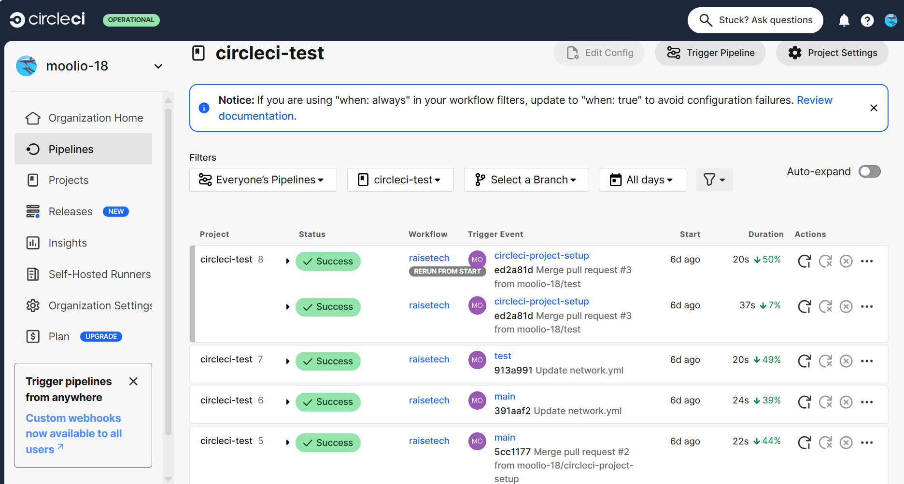
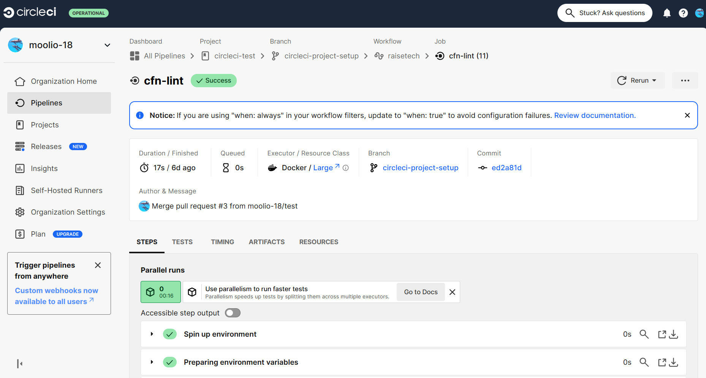
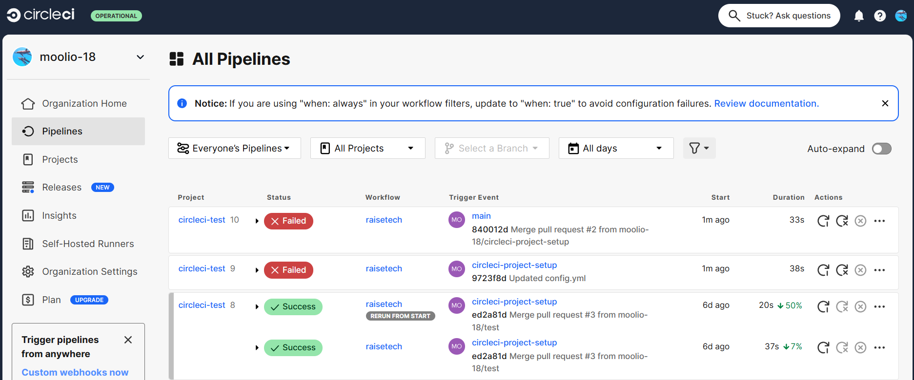
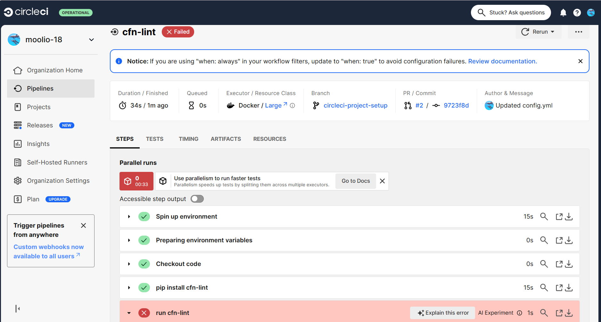
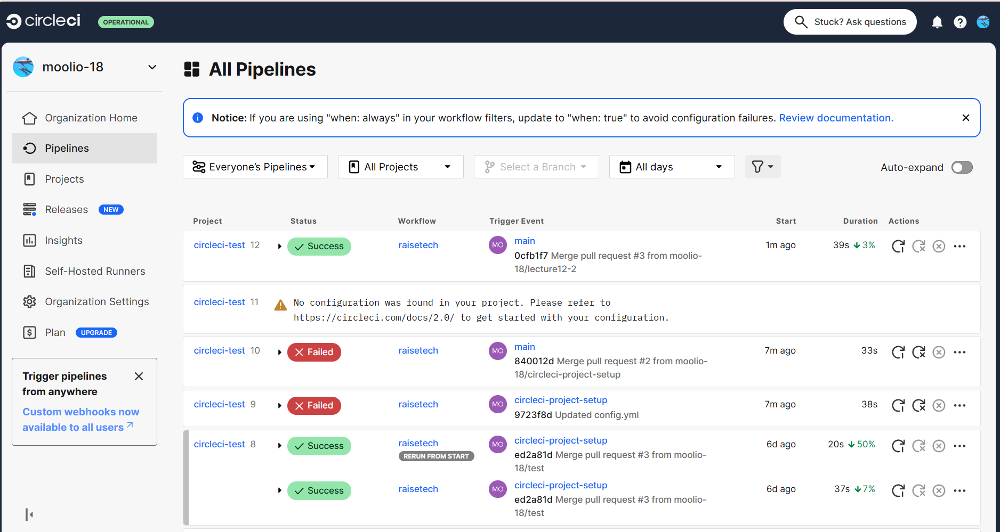
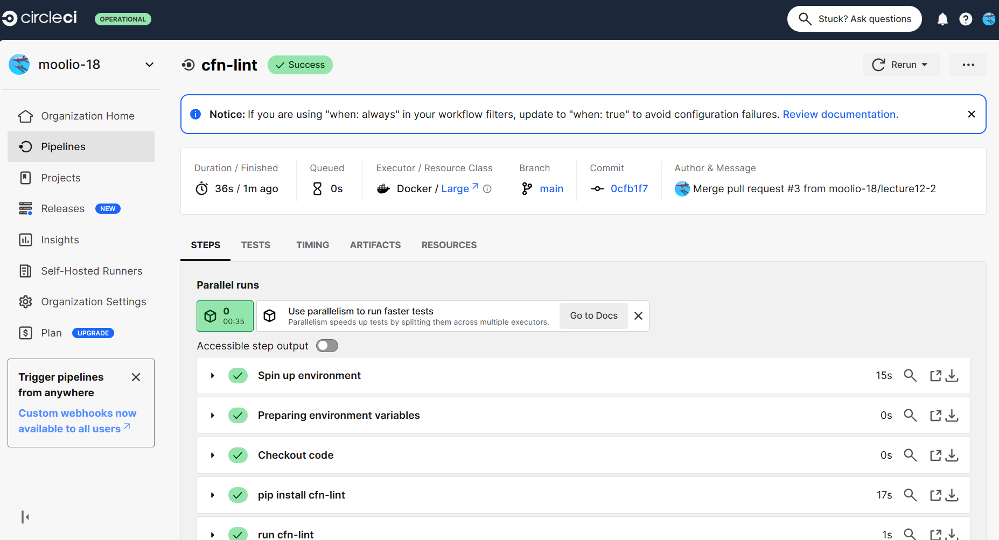

# 第12回


## 課題の内容　

CircleCIのサンプルコンフィグを動作するようにリポジトリに組み込む 
サンプルコンフィグの内容：cfn-lintを使ってAWS CloudFormationの記載内容に間違いがないか自動で確認する 

## 実施したこと

CircleCIのアカウントを作成　ログイン後、Githubと連携させる  
Projectsから　Set Up Project　を押して、Configを作成⇒GitHubのプルリクエスト作成  
GitHubのプルリクエストを承認　.circleci/config.ymlが作成される  
まずはデフォルトで入っている内容で実行できるか確認  
Successが表示された 



Configの内容を、今回の課題の[サンプルコンフィグ](https://github.com/MasatoshiMizumoto/raisetech_documents/blob/main/aws/samples/circleci/config.yml)に修正  
レポジトリ直下にディレクトリ　cloudformationを作成し、第10回課題で作成した  
テンプレート（[Lecture10_network.yml](/Lecture10_network.yml)、[Lecture10_security.yml](/Lecture10_security.yml)、[Lecture10_App.yml](/Lecture10_App.yml)）を格納し、Workflowを回す  
その結果、エラーが表示。（CircleCIのWorkflowがまわってclf-lintが動いていることは確認できた）



```表示されたエラー内容
W3010 Avoid hardcoding availability zones 'ap-northeast-1a'
cloudformation/network.yml:37:7

W3010 Avoid hardcoding availability zones 'ap-northeast-1a'
cloudformation/network.yml:63:7

W3010 Avoid hardcoding availability zones 'ap-northeast-1c'
cloudformation/network.yml:89:7

W3010 Avoid hardcoding availability zones 'ap-northeast-1c'
cloudformation/network.yml:107:7

E3014 Only one of ['CidrIp', 'CidrIpv6', 'SourcePrefixListId', 'SourceSecurityGroupId', 'SourceSecurityGroupName'] is a required property
cloudformation/security.yml:26:11

E3002 Additional properties are not allowed ('CidrIP' was unexpected. Did you mean 'CidrIp'?)
cloudformation/security.yml:29:11

E3014 Only one of ['CidrIp', 'CidrIpv6', 'SourcePrefixListId', 'SourceSecurityGroupId', 'SourceSecurityGroupName'] is a required property
cloudformation/security.yml:30:11

E3002 Additional properties are not allowed ('CidrIP' was unexpected. Did you mean 'CidrIp'?)
cloudformation/security.yml:33:11

E3014 Only one of ['CidrIp', 'CidrIpv6', 'SourcePrefixListId', 'SourceSecurityGroupId', 'SourceSecurityGroupName'] is a required property
cloudformation/security.yml:62:11

E3002 Additional properties are not allowed ('CidrIP' was unexpected. Did you mean 'CidrIp'?)
cloudformation/security.yml:65:11

W2506 'String' is not one of ['AWS::EC2::Image::Id', 'AWS::SSM::Parameter::Value<AWS::EC2::Image::Id>']
cloudformation/app.yml:15:5

W3010 Avoid hardcoding availability zones 'ap-northeast-1c'
cloudformation/app.yml:90:7

W1011 Use dynamic references over parameters for secrets
cloudformation/app.yml:97:7

Exited with code exit status 6
```
エラー内容を修正。修正後のファイル（[Lecture12_network.yml](/Lecture12_network.yml)、[Lecture12_security.yml](/Lecture12_security.yml)、[Lecture12_App.yml](/Lecture12_App.yml)）を格納。
再度Workflowを回し、Successとなったことを確認。




### 感想・学んだこと

AWS CloudFormationは前々回の課題で実施しており、きちんとスタックが作成されて、実際に動いていたので、特にエラーは出ないかと思っていたが、結構エラーが出た。EC2のAZの記載方法や、ImageIDなど、関数を使用してより適切な記載方法があることがわかり非常に勉強になった。RDSのパスワードは、直接記入することがないようにParameterで自分で直接記入する形にしたが、エラーが出たので調べ、SecretsManagerを使う形に変更したので、よりセキュアな内容に変更することができた。単純にテンプレートが作成できるか、というだけではなく、セキュリティ面等も考慮したチェック機能が働くので、経験が少ない人でも、ベストプラクティスに近い形で記載するために非常に便利な仕組みだと感じた。
